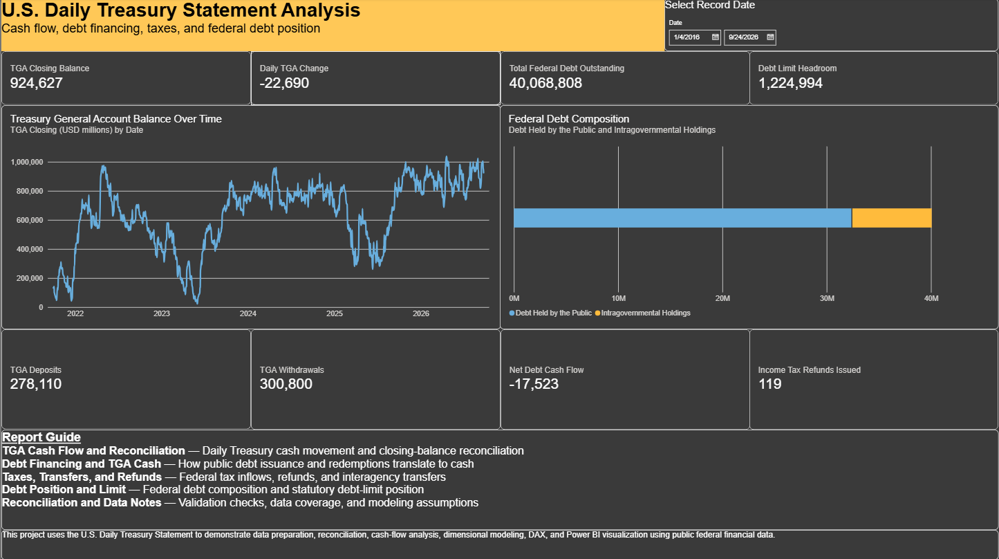
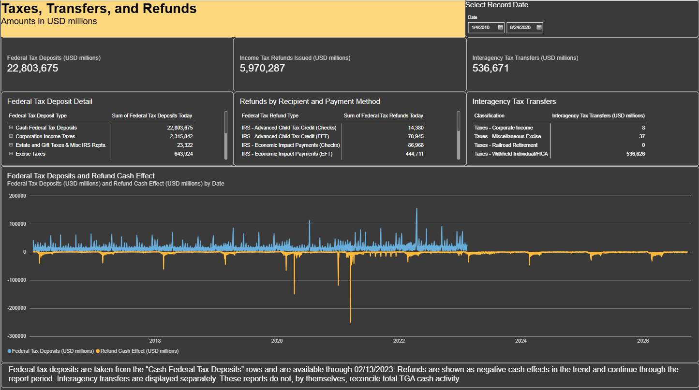
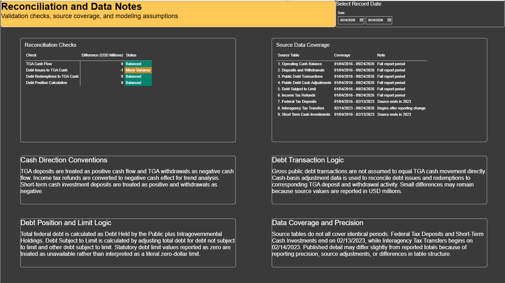

# U.S. Daily Treasury Statement Analysis

A Power BI portfolio project analyzing U.S. Daily Treasury Statement data with a focus on Treasury General Account cash flow, debt financing, reconciliation, tax activity, and the federal debt limit.

## Project Objective

This project was built to demonstrate practical analyst skills including:

- Power Query data preparation
- Power BI data modeling
- DAX measure development
- Financial reconciliation
- Cash-flow analysis
- Source-data validation
- Dashboard design and documentation

## Report Pages

### U.S. Daily TGA Analysis
Portfolio-facing summary of Treasury cash, federal debt, and selected-date activity.

### TGA Cash Flow and Reconciliation
Reconciles opening Treasury General Account cash, deposits, withdrawals, and reported closing balances.

### Debt Financing and TGA Cash
Connects gross public debt transactions to cash-basis adjustments and corresponding TGA cash activity.

### Taxes, Transfers, and Refunds
Analyzes federal tax deposits, income tax refunds, and interagency tax transfers.

### Debt Position and Limit
Examines federal debt composition, debt subject to limit, the statutory debt limit, and remaining debt-limit headroom.

### Reconciliation and Data Notes
Documents reconciliation checks, source coverage, cash-direction conventions, and modeling assumptions.

## Data Source

Data is sourced from the U.S. Department of the Treasury Daily Treasury Statement.

The project primarily covers January 2016 through September 2026, although individual source tables have different reporting periods.

## Key Data Coverage Notes

- Federal Tax Deposits: 01/04/2016 through 02/13/2023
- Short-Term Cash Investments: 01/04/2016 through 02/13/2023
- Interagency Tax Transfers: 02/14/2023 through 09/24/2026
- Most other source tables: 01/04/2016 through 09/24/2026

## Reconciliation Approach

Key validation checks include:

- Opening TGA balance + deposits - withdrawals = calculated closing balance
- Calculated TGA closing balance vs. reported closing balance
- Adjusted debt issuance cash vs. corresponding TGA debt-issue deposits
- Adjusted debt redemption cash vs. corresponding TGA debt-redemption withdrawals
- Federal debt composition vs. calculated debt subject to limit

Small variances may remain because source data is reported in USD millions and because detailed transaction tables may differ slightly from published totals.

## Tools Used

- Power BI
- Power Query
- DAX
- CSV source files from the U.S. Treasury

## Project Files

- [Download the Power BI file](Daily%20Treasury%20Statement%20Analysis.pbix)
- [View the full report PDF](2026-09-24%20Daily%20Treasury%20Statement%20Analysis.pdf)
- [Methodology](documentation/methodology.md)
- [Data Sources](documentation/data-sources.md)
- [Selected DAX Measures](documentation/dax-measures.md)

## Full Report

A PDF export of the completed report is included in the repository:

[View the full report PDF](2026-09-24%20Daily%20Treasury%20Statement%20Analysis.pdf)

## Screenshots

### TGA Cash Flow and Reconciliation

### Debt Financing and TGA Cash

### Taxes, Transfers, and Refunds

### Debt Position and Limit

### Reconciliation and Data Notes

