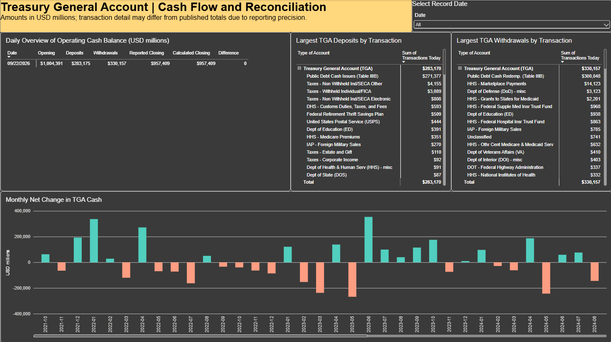
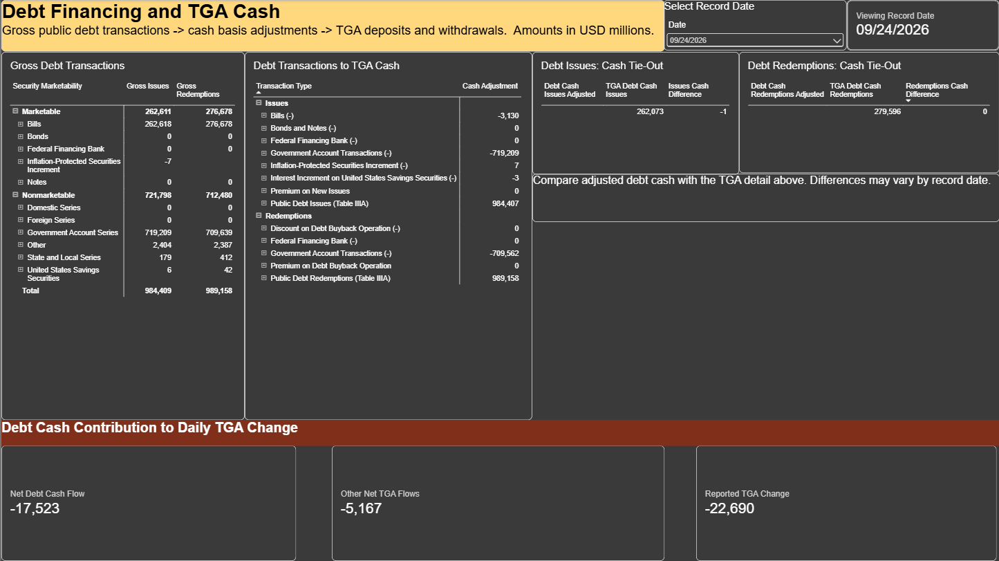
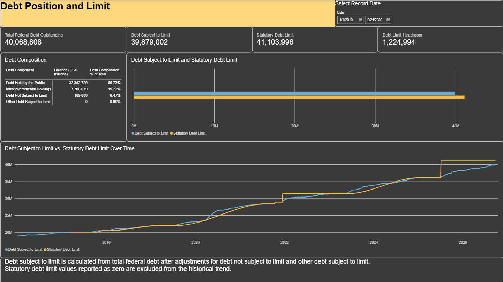

# U.S. Daily Treasury Statement Analysis

A financial data analysis project using **Power BI and Python** to explore U.S. Treasury cash flow, federal debt, tax activity, refunds, and other Treasury operations.

The project uses data from the U.S. Department of the Treasury's **Daily Treasury Statement (DTS)** and combines interactive reporting in Power BI with exploratory analysis and visualization in Python.

## Project Objective

This project was built to demonstrate practical analyst skills across the full process of working with financial data, including:

* Data preparation and transformation
* Power Query
* Power BI data modeling
* DAX measure development
* Financial reconciliation
* Cash-flow analysis
* Python data analysis with pandas
* Data visualization with matplotlib
* Source-data validation
* Documentation and reporting

Rather than recreating the same analysis in both tools, the Power BI and Python portions approach the Treasury data from different perspectives.

## Power BI Analysis

The Power BI portion focuses on Treasury cash management, federal debt, reconciliation, and tax-related activity.

### Report Pages

**U.S. Daily TGA Analysis**
Portfolio-facing summary of Treasury cash, federal debt, and selected-date activity.

**TGA Cash Flow and Reconciliation**
Reconciles opening Treasury General Account cash, deposits, withdrawals, and reported closing balances.

**Debt Financing and TGA Cash**
Connects gross public debt transactions to cash-basis adjustments and corresponding TGA cash activity.

**Taxes, Transfers, and Refunds**
Analyzes federal tax deposits, income tax refunds, and interagency tax transfers.

**Debt Position and Limit**
Examines federal debt composition, debt subject to limit, the statutory debt limit, and remaining debt-limit headroom.

**Reconciliation and Data Notes**
Documents reconciliation checks, source coverage, cash-direction conventions, and modeling assumptions.

## Python Analysis

The Python portion uses the Treasury income tax refund dataset to explore refund activity over time.

The analysis includes:

* Dataset preparation and validation
* Refund activity by type
* Monthly refund activity
* Seasonal refund patterns
* Economic Impact Payment analysis
* Payment-method analysis
* Refund-type comparisons
* Matplotlib visualizations

### Selected Findings

The Python analysis identified several notable patterns:

* The dataset contains **12,286 records** covering January 2016 through September 2026.
* **March 2021** was the highest-activity month in the dataset, with approximately **446,855** recorded refund activity.
* Economic Impact Payments accounted for approximately **71% of March 2021 activity**.
* February was the strongest average month for regular refund activity after excluding Economic Impact Payments and Advanced Child Tax Credit payments.
* February through April remained the strongest seasonal period even after excluding special payment programs, suggesting the seasonal pattern was not solely driven by pandemic-era payments.

The Python charts are included in the `Python/charts` folder.

## Data Source

Data is sourced from the **U.S. Department of the Treasury Daily Treasury Statement**.

The project primarily covers January 2016 through September 2026, although individual source tables have different reporting periods.

### Key Data Coverage Notes

* Federal Tax Deposits: 01/04/2016 through 02/13/2023
* Short-Term Cash Investments: 01/04/2016 through 02/13/2023
* Interagency Tax Transfers: 02/14/2023 through 09/24/2026
* Most other source tables: 01/04/2016 through 09/24/2026

The raw Treasury CSV files are used locally for analysis but are not included in the public repository.

## Reconciliation Approach

The Power BI analysis includes several validation checks, including:

* Opening TGA balance + deposits - withdrawals = calculated closing balance
* Calculated TGA closing balance vs. reported closing balance
* Adjusted debt issuance cash vs. corresponding TGA debt-issue deposits
* Adjusted debt redemption cash vs. corresponding TGA debt-redemption withdrawals
* Federal debt composition vs. calculated debt subject to limit

Small variances may remain because source data is reported in USD millions and because detailed transaction tables may differ slightly from published totals.

## Tools Used

### Power BI

* Power BI
* Power Query
* DAX
* Data modeling
* Financial reconciliation

### Python

* Python
* pandas
* matplotlib

### Data

* U.S. Treasury Daily Treasury Statement
* CSV source files

## Project Structure

```text
daily-treasury-statement-analysis/
│
├── README.md
│
├── Power BI/
│   ├── Daily Treasury Statement Analysis.pbix
│   └── 2026-09-24 Daily Treasury Statement Analysis.pdf
│
├── Python/
│   ├── treasury_analysis.py
│   ├── requirements.txt
│   ├── Treasury Financial Analysis Outline.docx
│   └── charts/
│       ├── economic_impact_payments.png
│       ├── eip_payment_method.png
│       ├── monthly_refund_activity.png
│       ├── seasonal_refund_activity.png
│       └── seasonal_refund_by_type.png
│
├── documentation/
│   ├── README.md
│   ├── data-sources.md
│   ├── dax-measures.md
│   └── methodology.md
│
└── Screenshots/
    ├── 01-overview.png
    ├── 02-tga-cash-flow-and-reconciliation.png
    ├── 03-debt-financing-and-tga-cash.png
    ├── 04-taxes-transfers-and-refunds.png
    ├── 05-debt-position-and-limit.png
    └── 06-reconciliation-and-data-notes.png
```

## Documentation

* [Methodology](documentation/methodology.md)
* [Data Sources](documentation/data-sources.md)
* [Selected DAX Measures](documentation/dax-measures.md)

## Power BI Report

[Download the Power BI file](Power%20BI/Daily%20Treasury%20Statement%20Analysis.pbix)

[View the full report PDF](Power%20BI/2026-09-24%20Daily%20Treasury%20Statement%20Analysis.pdf)

## Power BI Screenshots

### Report Overview


### TGA Cash Flow and Reconciliation



### Debt Financing and TGA Cash



### Taxes, Transfers, and Refunds


### Debt Position and Limit



### Reconciliation and Data Notes


